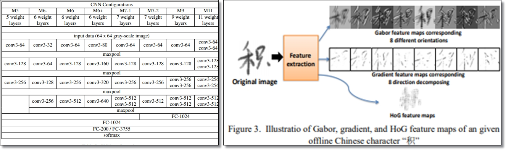
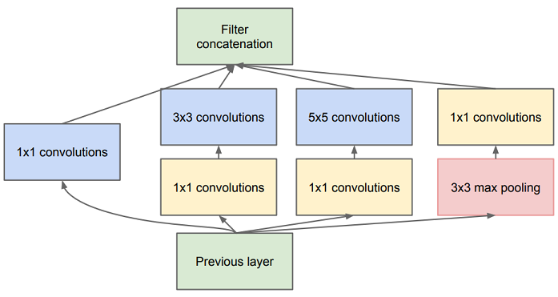
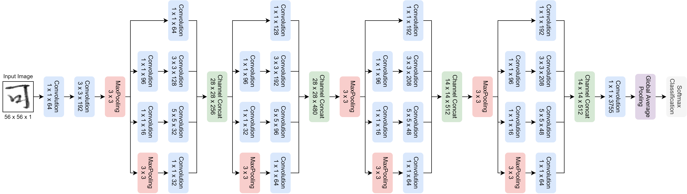
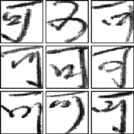
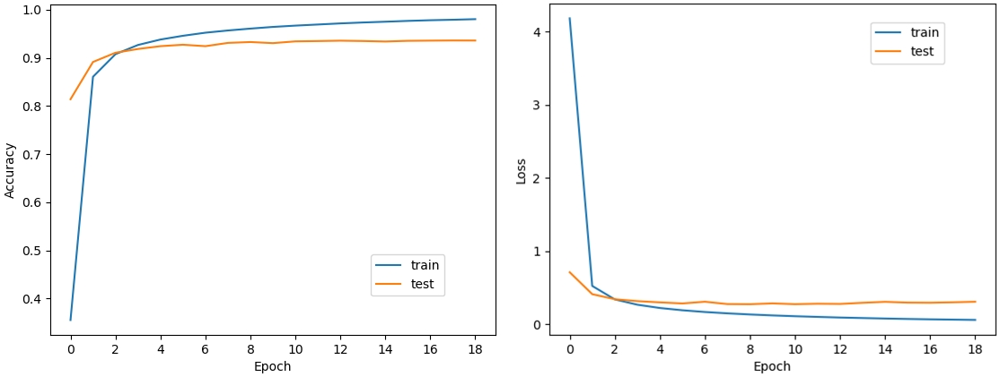
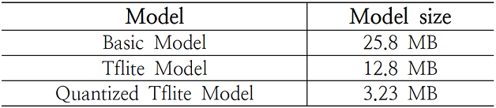
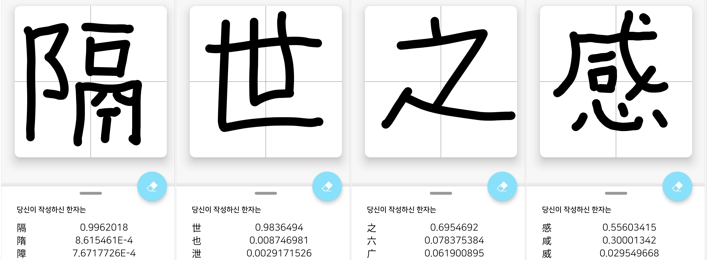

###### 안드로이드 환경에서 모델을 적용한 화면.

# Overview

심층 컨볼루션 신경망(CNN)을 사용한 이미지 인식 연구는 활발히 진행 중에 있다.

그 중에서도 언어 필기체 인식에 대한 정확도 향상에 많은 연구가 진행되었는데, 이 연구에서는 2014년 이미지 인식 대회(ILSVRC 14)에서 좋은 성적을 거둔 GoogLeNet에서 처음 제시된 Inception 모듈을 기반으로 구축한 깊은 컨볼루션 신경망을 한자 필기체 인식(HCCR) 문제에 적용하고, 이를 경량화하여 모바일 서비스에 적용하였다.

일반적인 컨볼루션 신경망에서는 깊은 구조를 가질수록 (더 많은 레이어를 가질수록) 성능이 좋아지지만, 모델의 파라미터 수가 기하급수적으로 증가한다는 문제점이 있다.

따라서 이 연구에서는 Inception 모듈을 이용한 깊은 CNN 구조를 설계하고, 3755개의 클래스와 약 110만 개의 데이터를 이용하여 학습을 시켰다. 이로 인해 적은 가중치 파라미터 수와 작은 크기의 모델로 상당한 성능을 낼 수 있음을 보여준다.

# 1. 서론

언어 필기체 인식에 관한 모델 연구는 옛날부터 다양한 곳에 적용하기 위해 연구되어 왔다. 하지만, 한자 필기체 인식에 있어서는, 한자의 클래스 수가 매우 많고, 복잡한 한자는 매우 많은 획과 불규칙한 곡선들 때문에 인식이 어렵다는 점들 때문에 단순한 모델로는 좋은 성능을 내기가 어려웠다.

하지만, 딥 러닝 기술의 등장으로 이미지 인식, 영상 인식 분야에 심층 컨볼루션 신경망(CNN)이 본격적으로 적용되기 시작하면서, 비약적인 성능 향상을 이루어냈다. 다양한 언어 필기체 인식 모델에도 심층 컨볼루션 신경망(CNN)을 적용하여 인식 성능을 높이려는 연구가 진행되고 있으며, 그러한 연구에서 기존의 모델에 비해 상당한 성능 향상을 보여주었다.

HCCR(Handwritten Chinese Character Recognition) 문제에도 심층 컨볼루션 신경망(CNN)이 적용되었는데, 다양한 HCCR 모델들이 제시되면서 한자 필기체 인식 연구가 활발히 진행되었다. 하지만, 한자의 특성 상 굉장히 많은 종류(클래스)로 구성되어 있고, 모델을 깊게 설계할수록 파라미터의 수가 기하급수적으로 늘어나기 때문에 실제 응용 프로그램에서 CNN 모델을 사용하기가 어렵다는 문제점에 도달하게 된다. 따라서 이 연구에서는 Inception 모듈 기반의 HCCR 문제 해결에 대한 효율적인 CNN 아키텍쳐를 제안하고, 가중치 공유, 가중치 가지치기 등 다양한 모델 압축 기법 중에서 모델 양자화 기법을 적용하여 안드로이드 환경에서의 실제 사용까지 이어짐을 보여준다. 따라서 기존의 CNN 모델보다 더 작은 파라미터 수와 더 적은 크기로 비슷한 성능을 낼 수 있음을 확인할 수 있었다.

# 2. 관련 연구

## 2.1. HCCR(Handwritten Chinese Character Recognition)

한자 필기체 인식 분야는 오래 전부터 다양한 방향으로 연구가 진행되었다. 하지만, 한자는 클래스 수가 많을뿐더러 복잡하고 어려운 구조로 인해 좋은 성능을 내지는 못했다.

그러나 이미지, 영상 인식 분야에 심층 컨볼루션 신경망(CNN)이 본격적으로 사용되면서 HCCR에도 CNN이 사용되었고, 그 결과 HCCR 연구에서 큰 성과를 보여주고 있다. CNN의 깊이가 다른 다양한 CNN 네트워크의 정확도를 비교[^3]하거나, 방향에 따른 특징 맵을 생성한 후 기존의 학습 데이터와 함께 CNN을 학습시켜 더욱 높은 정확도[^4]를 보이기도 한다.

###### HCCR 관련 다양한 연구들.

## 2.2. Inception Module(GoogLeNet)

심층 컨볼루션 신경망에서, 네트워크가 더 많은 레이어를 가질수록, 즉 네트워크가 깊어지면 깊어질수록 성능이 좋아지는 것은 분명하지만, 네트워크가 깊어질수록 학습해야 하는 파라미터의 수가 급격히 증가하고, 과적합 등의 문제 때문에 학습이 매우 힘들다. 하지만, Inception Module을 이용하면 이러한 문제점을 어느 정도 해결할 수 있다.

Inception이란 아키텍쳐를 처음 제시한 GoogLeNet[^2]은 기존의 CNN 모델 구조들보다 훨씬 더 깊은 구조를 가지면서 가중치 파라미터 수를 획기적으로 줄였다. Inception Module은 입력 값에 대해 4가지 종류의 Convolution, Pooling을 수행한 후, 그 결과들을 모두 결합시킨다. 이 과정에서 3x3, 5x5 Convolution 계층의 연산량을 줄이기 위해 1x1 Convolution 연산으로 채널을 감소시켰다가, 다시 확장시킨다. 이를 통해 3x3, 5x5 Convolution 계층 연산을 한층 더 쉽게 만들었다.

###### Inception Module.

# 3. 실험 및 평가

## 3.1. CNN 구조 설계

심층 컨볼루션 신경망(CNN)에서는 학습 데이터가 많고, 네트워크가 깊고 넓을수록 높은 정확도를 보인다. 이에 이미지 인식을 위한 ResNet, DenseNet 등 깊은 네트워크 아키텍쳐가 개발되어 컴퓨터 비전에서의 큰 발전을 보였다. 하지만 깊은 네트워크 모델들은 모델이 무겁고, 학습이 어렵다는 단점이 있다. 그러한 문제를 해결하기 위해 이 실험에서는 깊은 네트워크를 구성하면서 획기적으로 모델의 파라미터 수를 줄인 GoogLeNet[^2]의 구조를 기반으로 한자 필기체 인식에 맞도록 개선시켜 보았다.

기존의 GoogLeNet이 9개의 Inception 모듈을 사용한 것과는 달리, 아래의 모델은 4개의 Inception 모듈만을 사용하여 모델을 구성했다. 그리고 모델의 마지막 단에 들어가는 Fully-Connected Layer를 제거하고 최근 CNN 모델에서 많이 사용되는 Global Average Pooling Layer를 사용하였다. Global Average Pooling Layer를 사용한 이유는 Fully-Connected Layer를 사용함으로써 발생되는 단점을 보완하고, 각 특징 맵에서의 평균을 계산해 차원을 급격하게 줄여준다. 그리고 Fully-Connected Layer에 사용되는 많은 가중치 파라미터 수를 제거하여 모델을 경량화하기 위함이다.

###### HCCR Model.

## 3.2. 모델 학습

### 3.2.1. 학습 데이터

학습에 사용된 한자 필기체 데이터베이스인 CASIA Offline HWDB 1.1[^1]은 약 300명의 필기체를 기반으로 제작된 3755 클래스에 대한 1,121,749개의 데이터를 가진 데이터베이스이다. HWDB 1.1의 데이터 형식은 .gnt 파일이기 때문에, 이를 56x56 크기의 .png 파일로 전처리 후 사용한다.

학습 시에는 총 1,121,749개의 데이터를 8:2의 비율로 학습 데이터와 검증 데이터로 나누어 진행하였다.

###### CASIA Offline HWDB 1.1.[^1]

### 3.2.2. 실험 환경

학습 시에는 학습 속도를 올리기 위해 Mini-Batch 방식으로 학습을 진행하였다. Batch size는 학습 시 48, 테스트 시 32로 설정했다. 빠른 연산을 위해 GTX-1060 3GB (CUDA v10.0) 환경에서 학습이 진행되었으며, 딥러닝에 있어서 다양한 기능을 지원하는 머신러닝 라이브러리인 Tensorflow 2.0을 통해 진행했다.

# 4. 연구 결과 분석

## 4.1. 학습 결과

학습은 총 20세대 동안 진행되었으며, 약 897,000개의 학습 데이터를 이용해 약 18,000번의 학습을 진행하였다. 그 결과는 Train dataset에 대해 약 98%, Test Dataset에 대해 약 94%의 정확도를 얻을 수 있었다. 이 실험을 통해 기존 HCCR(Handwritten Chinese Character Recognition) 모델들보다 더 작은 크기의 모델 구조로 상당한 정확도를 얻는 것이 가능함을 보여 주었다.

###### Accuracy 그래프와 Loss 그래프.

## 4.2. 모델 양자화

앞선 과정으로 한자 필기체 모델을 학습시킨 뒤, 모바일 서비스에 적용하기 위해서는 모바일 서비스에 적합한 모델로 변환하는 과정이 필요하다. 그래서 이 연구에서는 Tensorflow에서 지원하는 Tensorflow Lite 모델로 변환시킴과 동시에, 모델 양자화를 진행했다. 현재 지원하는 모델 양자화 방법 중, 안정성이 높고 더 작은 크기를 요구하는 Dynamic Range Quantization을 진행했다.

Dynamic Range Quantization은 가중치 파라미터들의 부동 소수점 값을 8bit 정수형으로 압축시킴으로써, 약 75% 정도의 크기를 절약할 수 있다. 그 결과, 모델의 크기가 상당히 줄어듦을 확인할 수 있었다.

###### 최적화에 따른 모델의 크기.

## 4.3. 모바일 서비스 적용

앞선 모델 학습과 모델 양자화 실험에서 얻은 경량화된 한자 필기체 인식 모델을 안드로이드 환경에서의 어플리케이션에 적용해 봤다.

스마트폰 화면에 한자를 적으면, 해당 화면을 56x56x1 크기의 비트맵으로 변환한 후 모델의 입력으로 주어진다. 그러면 모델에서 예측을 한 뒤 모델이 예측한 값을 다시 받아 값이 큰 순서대로 출력한다.

어플리케이션 내에 HCCR 모델을 배치했기 때문에, 서버와의 통신 없이 온-디바이스 환경에서 바로 모델의 예측 결과를 알 수 있다. 그리고 3.23 MB의 상당히 가벼운 모델임에도 불구하고, 모바일 환경에서 높은 정확도를 보여준다. 하지만, 복잡한 한자는 인식률이 낮다는 점과, 3755개의 한자만 인식한다는 한계가 있어, 아직 개선해야 할 점이 남아 있음을 보여준다.

###### 경량화된 HCCR 모델을 모바일 서비스에 적용.

# 5. 결론

본 연구에서는 GoogLeNet[^2]에서 처음 제시된 Inception 모듈을 기반으로 한 깊은 컨볼루션 신경망(CNN)을 통해 한자 필기체 인식 모델을 구성하고, 이를 학습시킨 후 경량화, 최적화하여 최종적으로 안드로이드 환경의 모바일 서비스에 적용시켜 보았다.

이 연구를 통해, 상당히 작은 크기의 모델만을 가지고 기존의 HCCR(Handwritten Chinese Character Recognition) 모델들과 비슷한 성능을 낼 수 있음을 확인하였고, 모바일 환경에서 적은 공간만을 사용해 상당한 성능을 내는 모델을 만들 수 있음을 확인하였다.

모델 압축, 모델 경량화, 양자화 관련 기술 연구가 활발히 진행된다면, 기존의 모델들보다 더 가벼우면서도 상당한 성능을 보여주는 모델을 만들 수 있을 것이라 생각한다.

[^1]: Cheng-Lin Liu, Fei Yin, Da-Han Wang, Qiu-Feng Wang, “CASIA Online and Offline Chinese Handwriting Databases”, 2011 IEEE, pp.37-41, 2011.
[^2]: Christian Szegedy, Wei Liu, Yangqing Jia, Pierre Sermanet, Scott Reed, Dragomir Anguelov, Dumitru Erhan, Vincent Vanhoucke, Andrew Rabinovich, “Going deeper with convolutions”, in Proceeding of the Computer Vision and Pattern Recognition (CVPR), pp. 1-9, 2015. some deep representations”. CoRR, abs/1310.6343, 2013.
[^3]: Yuhao Zhong, “Deep Convolutional Network for Handwritten Chinese Character Recognition”. University of stanford, CS231N course project, 2015.
[^4]: Zhuoyao Zhong, Lianwen Jin, Zecheng Xie. “High Performance Offline Handwritten Chinese Character Recognition Using GoogLeNet and Directional Feature Maps”, IEEE, pp. 846-850, 2015.  