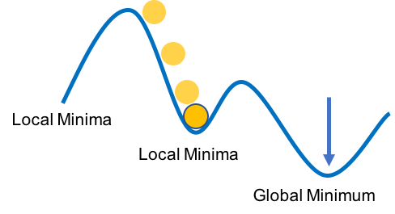
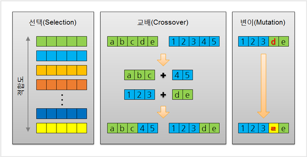

###### 외판원 순회 문제를 해결하는 모습.

# Problems

외판원 순회 문제(TSP, Traveling Salesman Problem)는 컴퓨터 과학 분야에서 중요한 문제로 취급되어 왔습니다.

완전 탐색으로 이 문제를 해결한다면, 도시의 수가 N개일 때, N!이라는 경우의 수를 모두 탐색해야지 답을 도출해낼 수 있었습니다. 만약 도시의 수가 20개라면 2,432,902,008,176,640,000이라는 매우 큰 경우의 수가 되고, 컴퓨터가 해결할 수 없게 됩니다.

그래서 다항 시간 내에 답을 "근사"할 수 있는 메타 휴리스틱(Meta-Heuristic) 기법을 활용해 이 문제를 해결해보려고 했습니다.

# 담금질 기법 - Simulated Annealing

전역 최적화 문제에 대한 메타 휴리스틱 기법 중 하나입니다.

광대한 탐색 범위 내에서 전역 최저점(Global Minimum)을 찾는 것을 목표로 동작합니다. 즉, 전역 최적해에 대한 근사치를 구해 냅니다.

담금질 기법의 동작 방법은 금속 공학의 담금질에서 파생되어 왔습니다. 금속재료를 가열한 뒤 조금씩 냉각하며 결함을 줄이는 것처럼, SA 알고리즘은 해를 반복적으로 개선시키며 현재의 해 근방에 있는 해를 임의로 찾습니다.

###### 지역 최저점과 전역 최저점.

# 유전 알고리즘 - Genetic Algorithm

생명과학의 유전 현상에서 영감을 얻어 개발된 알고리즘입니다. 전역 최적화 문제에 대한 메타 휴리스틱 기법입니다.

다윈의 진화론을 지탱하는 가장 중요한 개념 중 하나인 "자연 선택"을 기반으로 동작합니다. 또한, 생물의 진화를 모방한 진화 연산의 대표적인 기법으로써, 실제 세대의 진화 과정에서 많은 부분을 따라합니다.

###### 유전 알고리즘.

# 적용 및 결과

담금질 기법과 유전 알고리즘을 외판원 순회 문제에 적용시켜 봤습니다.

우선, 적용시키기 전에 현재 상태를 나타낼 수 있는 비용을 정의하고, 인접 상태를 정의했습니다.

TSP 문제는 순열 문제로 치환하여 풀 수 있습니다. 이를 활용해 현재 상태를 정의할 수 있습니다.

현재 상태를 정의했다면, 현재 상태를 조금 변경하여 도출할 수 있는 인접 상태도 정의할 수 있습니다. 현재 도시를 방문하는 순서를 조금만 변경하면 인접 상태라고 할 수 있죠.

