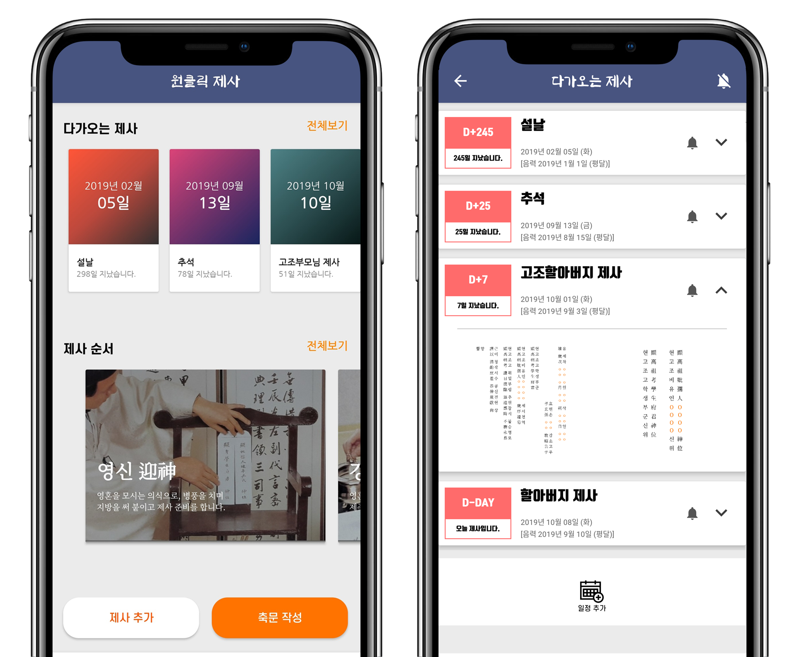
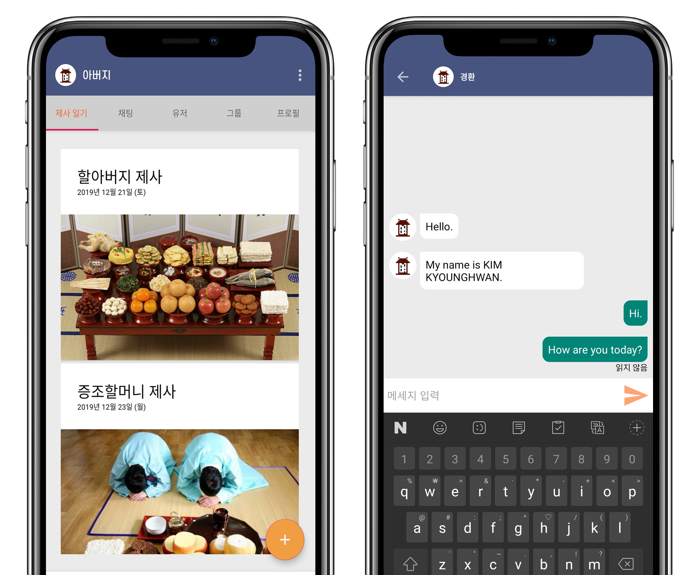

# 개발 동기

대한민국의 유교 문화 중 하나인 제사.

하지만 최근에는 제사를 많이 챙기지 않고, 제사에 대해 잘 모르는 사람들이 늘어나기 때문에, 날이 가면 갈수록 제사에 사용되는 축문과 지방을 직접 쓸 수 있는 사람이 줄어들 것이라 생각했습니다.

그래서 축문과 지방 작성을 도와주고, 제사에 대한 정보 등을 학습할 수 있는 교육용 애플리케이션을 개발하여 제사에 대한 인식을 개선하고 싶었습니다.

# 기대 효과

핵가족의 증가로 인해 사라져가는 대한민국의 전통 문화인 제사를 누구나 쉽고 편리하게 준비할 수 있는 기반이 되며, 방법 또는 절차를 몰라 제사를 지내지 못하는 모든 분들에게 큰 도움이 될 것입니다.

더 나아가, 제사에 대한 인식을 개선할 뿐만 아니라 대한민국의 제사를 널리 퍼뜨릴 수 있는 좋은 기회가 될 수 있습니다.

# 주요 기능 및 상세 설명

#### 1. 제사에 사용되는 축문과 지방을 손쉽게 작성할 수 있고, 저장 및 공유가 가능합니다.

제사에 사용되는 축문과 지방에는, 제사를 지내는 대상과 날짜에 따라 변하는 글자와 변하지 않는 글자들이 있습니다. 또, 축문은 음력 체계와 60갑자를 활용하기 때문에 이를 잘 모른다면 작성하기가 번거롭습니다.

작성 과정을 자동화하기 위해 축문과 지방에서 변하는 글자들을 조사한 뒤 이를 활용해 하나의 알고리즘으로 구현했습니다. 이 알고리즘을 통해 축문과 지방을 손쉽게 작성할 수 있습니다.

###### 제사를 지내는 날짜에 따라 축문의 내용이 변한다.

사용자가 제사에 관련된 정보를 알고 있다면 클릭 몇 번으로 축문과 지방을 생성할 수 있습니다. 제주와의 관계를 선택하고, 날짜와 본관 성씨 등을 입력하면 축문과 지방이 완성됩니다. 완성된 축문과 지방은 이미지 파일로 저장이 가능하고, 다른 사람에게 공유할 수 있습니다.

###### 축문과 지방을 생성하는 화면.

#### 2. 가족의 제사 일정을 추가 및 관리할 수 있습니다.

많은 제사 일정을 관리하기란 쉽지 않습니다. 하지만, 이 기능을 활용하면 다가오는 제사 일정을 한 눈에 확인할 수 있고, 해당 제사에 맞는 축문과 지방을 언제 어디서든 확인할 수 있습니다.

이 기능은 오픈소스 데이터베이스인 "SQLite"를 사용하여 개발되었습니다.

###### 제사 일정을 한 눈에 볼 수 있다.

#### 3. 가족 간의 커뮤니티를 구축해 채팅 및 사진 공유가 가능합니다.

가족 구성원들끼리 커뮤니티를 구축하여 서로 소통하고, 사진들을 공유하며 오랫동안 기억할 수 있습니다.

이 기능은 Google의 Firebase를 기반으로 개발되었습니다. 1대1 채팅 또한 Firebase의 Realtime Database를 활용했습니다.

###### 가족 커뮤니티 화면.

#### 4. 증강현실 상에서 제사상을 차려볼 수 있습니다.

제사상에 올라가는 음식들의 위치를 단번에 외우기란 쉽지 않습니다. 증강현실 상에서 제사 음식들을 배치해보면서 학습할 수 있습니다.

이 기능은 Google의 ARCore를 활용해 개발되었습니다.

###### 증강현실 제사상.

#### 5. 제사와 관련된 다양한 정보와 지식을 습득할 수 있습니다.

가장 기본적인 상차림 방법부터 지역별, 가족별로 다른 상차림 방법까지 알 수 있습니다.

제사상 퀴즈 메뉴에서는 앞서 공부한 정보들을 바탕으로 문제들을 해결할 수 있습니다. 총 10문제가 랜덤으로 주어지고, 문제당 10초의 시간이 주어집니다.

###### 제사상 정보와 제사상 퀴즈.

# 관련 링크

[Google Play 스토어](https://play.google.com/store/apps/details?id=com.jesa)